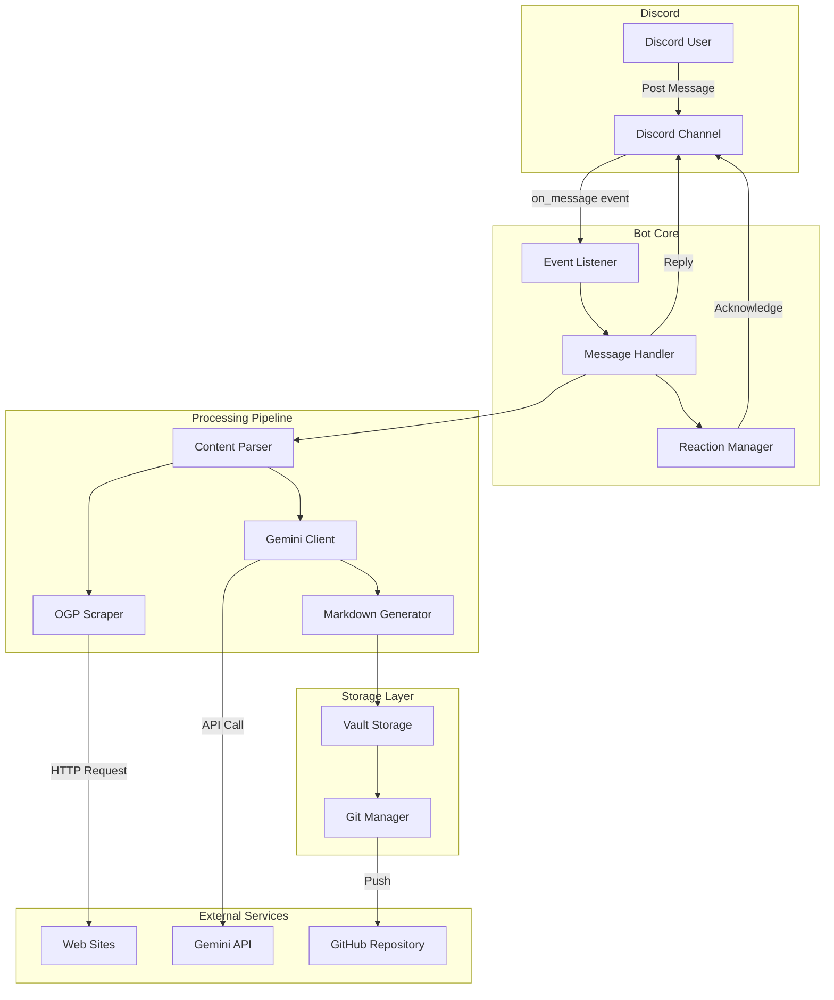
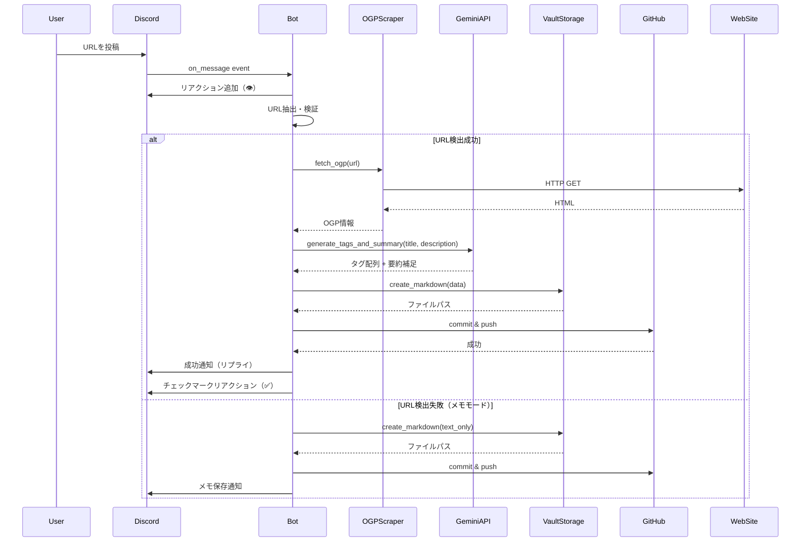
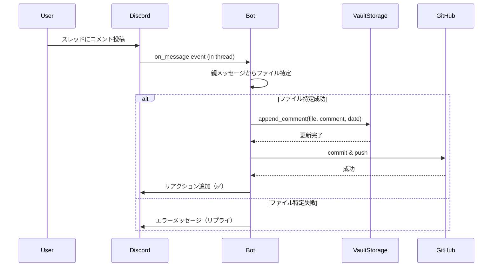
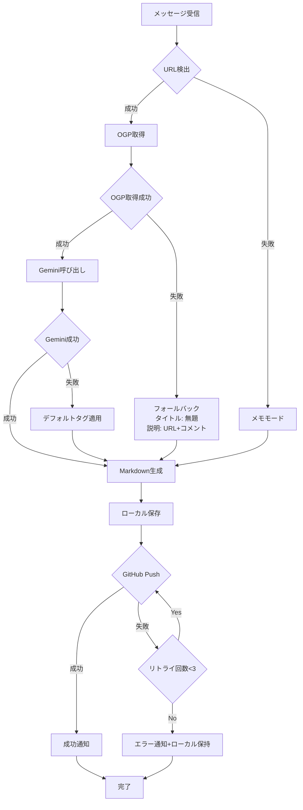
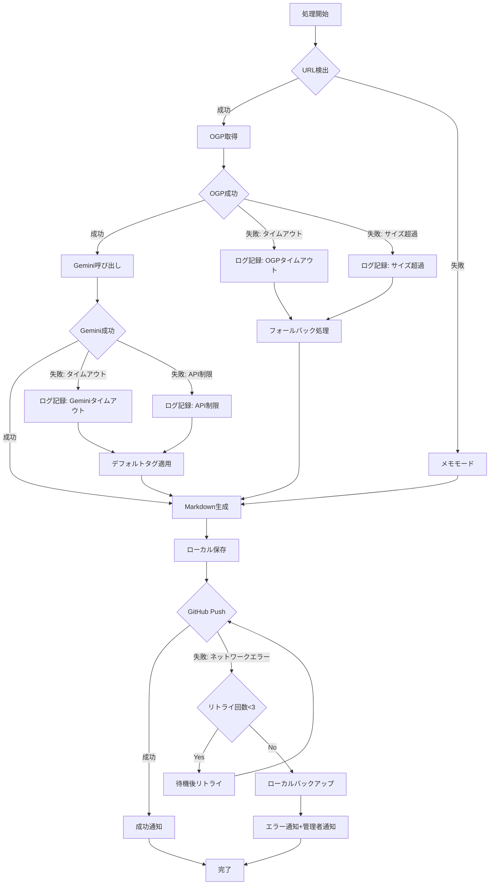

# Design Document

## Overview

本機能は、Discord Bot を活用した記事ストック・整理システム「Article Stock Bot」を実現します。ユーザーがDiscordにURLや記事リンクを投稿するだけで、自動的にOGP情報を取得し、Gemini AIによるタグ付け・要約を行い、最終的にObsidian VaultにMarkdown形式で保存します。

**対象ユーザー**: 個人利用者（移動中に記事を見つけ、後から「消化可能な状態」で振り返りたいユーザー）

**主要な価値**: 記事を保存するだけでなく、AI要約とタグ付けで「消化可能な状態」で整理し、Obsidian Vault内で活用できるまでを自動化します。

### Goals

- Discordチャンネルへの投稿で記事URLを自動的にストック
- OGP情報の自動取得とフォールバック処理による堅牢性
- Gemini AIによる3〜5個のタグ付けと要約補足の生成
- Obsidian互換のMarkdown形式での保存
- GitHub Repository経由での自動同期
- 既存記事へのスレッド経由でのコメント追記
- エラー発生時の適切なフォールバックと通知

### Non-Goals

- 複数ユーザー対応（個人利用に限定）
- Notion連携
- ペイウォール記事の全文取得
- 音声メモ対応（Nice to Have扱い）
- リアルタイム通知機能

## Architecture

### Architecture Pattern & Boundary Map

**選定パターン**: Event-Driven Bot Architecture（イベントリスナー + 処理パイプライン）

**アーキテクチャ図**:



**ドメイン境界**:
- **Bot Core**: Discord APIとの接続とイベントハンドリング
- **Processing Pipeline**: 記事情報の取得・加工・生成
- **Storage Layer**: ファイル生成とGit操作
- **External Services**: 外部API・サービスとの通信

**責任分離の原則**:
- 各モジュールは単一責任を持つ（OGP取得、AI処理、ファイル生成、Git操作）
- エラーハンドリングは各モジュール内で完結し、上位に影響を与えない
- 非同期処理により、Discordイベントループをブロックしない

**ステアリング遵守**:
- 処理フロー中心の設計（structure.md準拠）
- Event-Drivenアーキテクチャ（tech.md準拠）
- 依存関係の最小化とエラーハンドリングの一貫性（structure.md準拠）

### Technology Stack

| Layer | Choice / Version | Role in Feature | Notes |
|-------|------------------|-----------------|-------|
| Runtime | Python 3.11+ | 言語基盤 | Type Hints活用、async/await対応 |
| Bot Framework | discord.py 2.x | Discordイベントリスナー | 公式SDKの安定版、非同期処理 |
| LLM | Gemini Flash 2.5 | タグ付け・要約生成 | 低コスト・高速レスポンス |
| Web Scraping | beautifulsoup4 + **aiohttp** | OGP情報取得 | **非同期HTTP通信**、標準的なHTML解析 |
| Git Automation | GitPython | GitHub自動プッシュ | Pythonネイティブなインターフェース（`asyncio.to_thread()`でラップ） |
| Environment | python-dotenv | 環境変数管理 | API Key等の秘匿情報管理 |
| Hosting | Raspberry Pi | 24時間稼働環境 | 自宅サーバー、低コスト |
| Storage | GitHub Repository | Obsidian Vault同期 | バージョン管理と同期の統合 |

**コード品質ツール**:
- Linter: ruff または flake8
- Formatter: black
- Import Sorting: isort
- Testing: pytest

## System Flows

### 記事処理メインフロー



### コメント追記フロー



### エラーハンドリングフロー



## Requirements Traceability

| Requirement | Summary | Components | Interfaces | Flows |
|-------------|---------|------------|------------|-------|
| 1.1, 1.2, 1.3, 1.4, 1.5 | Discordメッセージ受信と初期処理 | EventListener, MessageHandler, ReactionManager | `on_message` event, Discord API | メインフロー |
| 2.1, 2.2, 2.3, 2.4, 2.5 | 入力内容の判別と検証 | ContentParser | `parse_message()` | メインフロー |
| 3.1, 3.2, 3.3, 3.4, 3.5, 3.6, 3.7 | OGP情報の取得とフォールバック | OGPScraper | `fetch_ogp()` | メインフロー、エラーハンドリング |
| 4.1, 4.2, 4.3, 4.4, 4.5, 4.6, 4.7 | Gemini AIによるタグ付けと要約 | GeminiClient | `generate_tags_and_summary()` | メインフロー、エラーハンドリング |
| 5.1, 5.2, 5.3, 5.4, 5.5, 5.6, 5.7, 5.8 | Markdownファイルの生成 | MarkdownGenerator, VaultStorage | `create_markdown()` | メインフロー |
| 6.1, 6.2, 6.3, 6.4, 6.5, 6.6, 6.7 | GitHub Repositoryへの自動プッシュ | GitManager | `commit_and_push()` | メインフロー、エラーハンドリング |
| 7.1, 7.2, 7.3, 7.4, 7.5, 7.6 | Discordへのレスポンス | MessageHandler, ReactionManager | Discord API (`reply()`, `add_reaction()`) | メインフロー |
| 8.1, 8.2, 8.3, 8.4, 8.5, 8.6 | 既存記事へのコメント追記 | MessageHandler, VaultStorage, GitManager | `append_comment()` | コメント追記フロー |
| 9.1, 9.2, 9.3, 9.4, 9.5, 9.6, 9.7 | エラーハンドリングとロギング | Logger (全モジュール共通) | `logging` module | エラーハンドリングフロー |

## Components and Interfaces

### コンポーネントサマリー

| Component | Domain/Layer | Intent | Req Coverage | Key Dependencies (P0/P1) | Contracts |
|-----------|--------------|--------|--------------|--------------------------|-----------|
| EventListener | Bot Core | Discordイベントを受信しハンドラに委譲 | 1.1, 1.3 | discord.py (P0), MessageHandler (P0) | Event, Service |
| MessageHandler | Bot Core | メッセージ処理全体のオーケストレーション | 1.1, 1.2, 1.4, 1.5, 7.1, 7.2, 7.3, 7.4, 7.5, 7.6, 8.1 | ContentParser (P0), OGPScraper (P1), GeminiClient (P1) | Service |
| ReactionManager | Bot Core | Discordリアクションの追加・管理 | 1.4, 7.5, 8.5 | discord.py (P0) | Service |
| ContentParser | Processing Pipeline | メッセージ内容の判別とURL抽出 | 2.1, 2.2, 2.3, 2.4, 2.5 | なし | Service |
| OGPScraper | Processing Pipeline | OGP情報の取得とフォールバック処理 | 3.1, 3.2, 3.3, 3.4, 3.5, 3.6, 3.7 | requests (P0), beautifulsoup4 (P0) | Service |
| GeminiClient | Processing Pipeline | Gemini APIによるタグ付けと要約生成 | 4.1, 4.2, 4.3, 4.4, 4.5, 4.6, 4.7 | google-generativeai (P0) | Service |
| MarkdownGenerator | Processing Pipeline | Markdown形式のファイル生成 | 5.1, 5.2, 5.3, 5.4, 5.5, 5.6, 5.7 | なし | Service |
| VaultStorage | Storage Layer | ローカルファイルシステムへの保存 | 5.8, 8.2, 8.3 | pathlib (P0) | Service |
| GitManager | Storage Layer | Gitコミットとリモートプッシュ | 6.1, 6.2, 6.3, 6.4, 6.5, 6.6, 6.7 | GitPython (P0) | Service |
| Logger | Utility | 全モジュール共通のロギング機能 | 9.1, 9.2, 9.3, 9.4, 9.5, 9.6 | logging (P0) | Service |

### Bot Core

#### EventListener

| Field | Detail |
|-------|--------|
| Intent | Discord.pyのイベントリスナーとして動作し、メッセージイベントを受信してMessageHandlerに処理を委譲する |
| Requirements | 1.1, 1.3 |

**責任と制約**:
- `on_message` イベントをフック
- Bot自身の投稿および他のBot投稿を除外（1.5）
- メッセージ受信後、非同期でMessageHandlerに委譲

**依存関係**:
- Inbound: discord.py Client — イベント発火 (P0)
- Outbound: MessageHandler — メッセージ処理委譲 (P0)

**Contracts**: Service [x] / Event [x]

##### Service Interface

```python
from discord import Client, Message

class EventListener(Client):
    """Discord Botのイベントリスナー"""

    async def on_message(self, message: Message) -> None:
        """
        メッセージ受信イベント

        Preconditions:
        - Botが正常に起動済み
        - 監視対象チャンネルが設定済み

        Postconditions:
        - Bot自身と他のBotのメッセージを除外
        - MessageHandlerに処理を委譲
        """
        pass
```

##### Event Contract

- **Subscribed events**: `on_message` (discord.py)
- **Ordering / delivery guarantees**: Discord側のイベント発火順序に依存

**Implementation Notes**:
- Integration: discord.pyの`Client`クラスを継承し、`on_message`をオーバーライド
- Validation: `message.author.bot`フラグで Bot 判定
- Risks: Discord API のレート制限（通常の個人利用では影響なし）
- **非同期処理**: discord.pyのイベントループで動作。すべての処理は`async/await`を使用し、イベントループをブロックしない

---

#### MessageHandler

| Field | Detail |
|-------|--------|
| Intent | メッセージ処理全体のオーケストレーター。URL検出、OGP取得、AI処理、保存、通知を統括する |
| Requirements | 1.1, 1.2, 1.4, 1.5, 7.1, 7.2, 7.3, 7.4, 7.5, 7.6, 8.1 |

**責任と制約**:
- メッセージ内容の解析とURL判定
- 処理パイプラインの実行順序制御
- エラーハンドリングとフォールバック処理
- Discord への成功・失敗通知

**依存関係**:
- Inbound: EventListener — メッセージ処理依頼 (P0)
- Outbound: ContentParser — 入力内容判別 (P0)
- Outbound: OGPScraper — OGP情報取得 (P1)
- Outbound: GeminiClient — タグ付け・要約生成 (P1)
- Outbound: MarkdownGenerator — Markdown生成 (P0)
- Outbound: VaultStorage — ファイル保存 (P0)
- Outbound: GitManager — GitHub プッシュ (P0)
- Outbound: ReactionManager — リアクション管理 (P0)

**Contracts**: Service [x]

##### Service Interface

```python
from discord import Message
from typing import Optional
from dataclasses import dataclass

@dataclass
class ProcessResult:
    """処理結果"""
    success: bool
    file_path: Optional[str]
    error_message: Optional[str]

class MessageHandler:
    """メッセージ処理オーケストレーター"""

    async def handle_new_message(self, message: Message) -> ProcessResult:
        """
        新規メッセージの処理

        Preconditions:
        - message が Bot 以外からの投稿
        - 監視対象チャンネル内

        Postconditions:
        - リアクション追加（受信確認）
        - 処理成功時: Markdownファイル保存 + GitHub プッシュ + 成功通知
        - 処理失敗時: エラー通知

        Returns:
        - ProcessResult: 処理結果
        """
        pass

    async def handle_thread_comment(self, message: Message) -> bool:
        """
        スレッド内コメント追記処理

        Preconditions:
        - message がスレッド内の投稿
        - 親メッセージがBot自身の返信

        Postconditions:
        - 該当記事ファイルにコメント追記
        - GitHub再プッシュ
        - リアクション追加

        Returns:
        - bool: 処理成功可否
        """
        pass
```

**Implementation Notes**:
- Integration: すべての処理モジュールを統合し、エラー時のフォールバックロジックを実装
- Validation: 各ステップでの成功・失敗を判定し、適切な通知を送信
- Risks: 処理時間が30秒を超える場合、Discord側でタイムアウトの可能性（非同期処理で回避）
- **並行処理制御**: `asyncio.Semaphore(max_concurrent=3)`を使用し、最大3件までの同時処理を許可。過剰な並行処理によるリソース枯渇を防止

---

#### ReactionManager

| Field | Detail |
|-------|--------|
| Intent | Discord メッセージへのリアクション追加を管理 |
| Requirements | 1.4, 7.5, 8.5 |

**責任と制約**:
- 受信確認リアクション（👁️）の追加
- 処理完了リアクション（✅）の追加
- リアクション追加失敗時のログ記録

**依存関係**:
- Inbound: MessageHandler — リアクション追加依頼 (P0)
- Outbound: discord.py API — リアクション追加実行 (P0)

**Contracts**: Service [x]

##### Service Interface

```python
from discord import Message
from typing import Literal

ReactionType = Literal["acknowledge", "success", "error"]

class ReactionManager:
    """Discord リアクション管理"""

    async def add_reaction(self, message: Message, reaction_type: ReactionType) -> bool:
        """
        メッセージにリアクションを追加

        Preconditions:
        - message が有効なDiscordメッセージオブジェクト

        Postconditions:
        - 指定された絵文字のリアクションが追加される
        - 失敗時はログに記録される

        Returns:
        - bool: リアクション追加成功可否
        """
        pass
```

**Implementation Notes**:
- Integration: discord.py の `Message.add_reaction()` を使用
- Validation: リアクション追加失敗時はログ記録のみで処理継続
- Risks: Discord APIレート制限（個人利用では影響薄）

---

### Processing Pipeline

#### ContentParser

| Field | Detail |
|-------|--------|
| Intent | メッセージ内容を解析し、URL、コメント、メモを判別・抽出する |
| Requirements | 2.1, 2.2, 2.3, 2.4, 2.5 |

**責任と制約**:
- URL形式の正規表現検証（HTTP/HTTPS）
- URL とコメントの分離
- 複数URL検出時は最初のみ処理（2.4）

**依存関係**:
- なし（標準ライブラリのみ使用）

**Contracts**: Service [x]

##### Service Interface

```python
from dataclasses import dataclass
from typing import Optional

@dataclass
class ParsedContent:
    """解析されたメッセージ内容"""
    content_type: Literal["url", "memo"]
    url: Optional[str]
    comment: Optional[str]

class ContentParser:
    """メッセージ内容解析"""

    def parse_message(self, text: str) -> ParsedContent:
        """
        メッセージからURL・コメント・メモを抽出

        Preconditions:
        - text が非空文字列

        Postconditions:
        - URL検出時: content_type="url", url, comment(optional)
        - URL未検出時: content_type="memo", comment=text

        Invariants:
        - HTTP/HTTPSプロトコル含むURLのみ認識（2.5）
        - 複数URL検出時は最初のみ処理（2.4）

        Returns:
        - ParsedContent: 解析結果
        """
        pass
```

**Implementation Notes**:
- Integration: 標準ライブラリの `re` モジュールを使用
- Validation: URL正規表現パターン `https?://\S+`
- Risks: 特殊なURLエンコーディング（基本的なURLのみサポート）

---

#### OGPScraper

| Field | Detail |
|-------|--------|
| Intent | WebページからOGP情報（タイトル、概要、画像）を取得し、フォールバック処理を実装 |
| Requirements | 3.1, 3.2, 3.3, 3.4, 3.5, 3.6, 3.7 |

**責任と制約**:
- OGPメタタグの抽出（`og:title`, `og:description`, `og:image`）
- フォールバック: `<title>` タグ、`<meta name="description">`
- タイムアウト処理（10秒）とサイズ制限（10MB）
- ネットワークエラー時のエラーハンドリング

**依存関係**:
- Outbound: aiohttp — 非同期HTTP通信 (P0)
- Outbound: beautifulsoup4 — HTML解析 (P0)
- External: Web Sites — OGP情報取得先 (P0)

**Contracts**: Service [x]

##### Service Interface

```python
from dataclasses import dataclass
from typing import Optional

@dataclass
class OGPData:
    """OGP情報"""
    title: Optional[str]
    description: Optional[str]
    image: Optional[str]
    url: str
    fetch_success: bool
    error_message: Optional[str]

class OGPScraper:
    """OGP情報取得"""

    TIMEOUT_SECONDS: int = 10
    MAX_CONTENT_SIZE: int = 10 * 1024 * 1024  # 10MB

    async def fetch_ogp(self, url: str) -> OGPData:
        """
        URLからOGP情報を取得

        Preconditions:
        - url が有効なHTTP/HTTPS URL

        Postconditions:
        - 成功時: OGPデータを返す
        - OGP取得失敗時: title, descriptionにフォールバック値を設定
        - 完全失敗時: fetch_success=False, error_message設定

        Invariants:
        - タイムアウト: 10秒（3.6）
        - サイズ制限: 10MB（3.7）

        Returns:
        - OGPData: 取得結果
        """
        pass
```

**Implementation Notes**:
- Integration: **`aiohttp` + `BeautifulSoup`** で非同期HTML解析。`async with aiohttp.ClientSession() as session`パターンを使用し、`session.get(url, timeout=aiohttp.ClientTimeout(total=10))`で取得
- Validation: タイムアウト・サイズチェック後、OGPタグ検索 → フォールバック → デフォルト値
- **非同期実装**: `asyncio.to_thread()`を使用せず、完全非同期化。`aiohttp`の`async with`構文で自動的にコネクションクローズ
- Risks: Webサイトによってはrobots.txtやUser-Agent制限で取得失敗の可能性。User-Agentヘッダーを適切に設定

---

#### GeminiClient

| Field | Detail |
|-------|--------|
| Intent | Gemini Flash 2.5 APIを呼び出し、タグ付けと要約補足を生成する |
| Requirements | 4.1, 4.2, 4.3, 4.4, 4.5, 4.6, 4.7 |

**責任と制約**:
- 記事タイトル・概要を元にGemini APIを呼び出し
- 3〜5個のタグ生成（日本語短フレーズ）
- 要約補足テキストの生成
- タイムアウト処理（30秒）とフォールバック（デフォルトタグ）

**依存関係**:
- Outbound: google-generativeai — Gemini API (P0)
- External: Gemini API — タグ付け・要約生成 (P0)

**Contracts**: Service [x]

##### Service Interface

```python
from dataclasses import dataclass
from typing import List, Optional

@dataclass
class AIAnalysisResult:
    """AI解析結果"""
    tags: List[str]
    summary_supplement: Optional[str]
    success: bool
    error_message: Optional[str]

class GeminiClient:
    """Gemini API クライアント"""

    TIMEOUT_SECONDS: int = 30
    DEFAULT_TAGS: List[str] = ["未分類", "要確認"]

    async def generate_tags_and_summary(
        self,
        title: str,
        description: str
    ) -> AIAnalysisResult:
        """
        記事タイトルと概要からタグと要約補足を生成

        Preconditions:
        - title または description のいずれかが非空
        - Gemini API Key が設定済み

        Postconditions:
        - 成功時: 3〜5個のタグと要約補足を返す
        - 失敗時: DEFAULT_TAGSを返す

        Invariants:
        - タイムアウト: 30秒（4.7）
        - タグ数: 3〜5個（4.2, 4.3）
        - タグ形式: 日本語の単語または短フレーズ（4.3）

        Returns:
        - AIAnalysisResult: 解析結果
        """
        pass
```

**実装のためのプロンプトテンプレート例**:
```python
PROMPT_TEMPLATE = """
以下の記事情報から、適切なタグを3〜5個生成してください。
タグは日本語の単語または短いフレーズ形式で、記事の主題や技術分野を表すものにしてください。

タイトル: {title}
概要: {description}

また、この記事の要点を100字以内で補足してください。

出力形式:
タグ: [タグ1, タグ2, タグ3, ...]
要約補足: (補足テキスト)
"""
```

**Implementation Notes**:
- Integration: `google.generativeai.GenerativeModel` を使用
- Validation: タグ数の検証（3〜5個）、タイムアウト監視
- Risks: Gemini API制限（個人利用の無料枠内で運用）、レスポンス遅延

---

#### MarkdownGenerator

| Field | Detail |
|-------|--------|
| Intent | 記事情報からObsidian互換のMarkdownファイルを生成する |
| Requirements | 5.1, 5.2, 5.3, 5.4, 5.5, 5.6, 5.7 |

**責任と制約**:
- YAMLフロントマター生成（tags, url, created）
- Markdownボディ生成（タイトル、概要、コメント）
- ファイル名生成（`YYYY-MM-DD_記事タイトル.md`形式）
- ファイル名サニタイゼーション（最大100文字）

**依存関係**:
- なし（標準ライブラリのみ使用）

**Contracts**: Service [x]

##### Service Interface

```python
from dataclasses import dataclass
from datetime import date
from typing import List, Optional

@dataclass
class ArticleData:
    """記事データ"""
    title: str
    url: str
    description: str
    tags: List[str]
    comment: Optional[str]
    created_date: date
    summary_supplement: Optional[str]

@dataclass
class GeneratedMarkdown:
    """生成されたMarkdown"""
    filename: str
    content: str

class MarkdownGenerator:
    """Markdown生成"""

    MAX_FILENAME_LENGTH: int = 100

    def generate_markdown(self, data: ArticleData) -> GeneratedMarkdown:
        """
        記事データからMarkdownファイルを生成

        Preconditions:
        - data.title が非空
        - data.url が有効なURL

        Postconditions:
        - YAMLフロントマター付きMarkdown生成（5.2）
        - ファイル名: YYYY-MM-DD_タイトル.md 形式（5.6）
        - ファイル名最大100文字（5.7）

        Invariants:
        - 必須セクション: タイトル（#）、概要（##）
        - オプションセクション: コメント（##）（5.5）

        Returns:
        - GeneratedMarkdown: ファイル名とMarkdown内容
        """
        pass

    def sanitize_filename(self, text: str) -> str:
        """
        ファイル名に使用できない文字をサニタイズ

        Removes: / \ : * ? " < > |
        """
        pass
```

**Markdownテンプレート例**:
```markdown
---
tags: [タグ1, タグ2, タグ3]
url: https://example.com/article
created: 2025-12-04
---

# 記事タイトル

## 概要

OGP description内容

Geminiによる要約補足内容

## コメント

- 2025-12-04: 初回投稿時のコメント
```

**Implementation Notes**:
- Integration: 標準ライブラリ（`datetime`, `re`）を使用
- Validation: ファイル名の無効文字除去、長さ制限
- Risks: 特殊文字を含むタイトル（サニタイゼーションで対応）

---

### Storage Layer

#### VaultStorage

| Field | Detail |
|-------|--------|
| Intent | ローカルファイルシステムへのMarkdownファイル保存とコメント追記 |
| Requirements | 5.8, 8.2, 8.3 |

**責任と制約**:
- `vault/articles/` ディレクトリへのファイル書き込み
- 既存ファイルへのコメントセクション追記
- ディレクトリ自動作成

**依存関係**:
- Outbound: pathlib — ファイルシステム操作 (P0)

**Contracts**: Service [x]

##### Service Interface

```python
from pathlib import Path
from datetime import date

class VaultStorage:
    """Vault ストレージ管理"""

    VAULT_DIR: Path = Path("vault/articles")

    def save_markdown(self, filename: str, content: str) -> Path:
        """
        Markdownファイルを保存

        Preconditions:
        - filename が有効なファイル名
        - content が非空文字列

        Postconditions:
        - vault/articles/ ディレクトリにファイル保存
        - ディレクトリが存在しない場合は自動作成

        Returns:
        - Path: 保存されたファイルのパス
        """
        pass

    def append_comment(
        self,
        file_path: Path,
        comment: str,
        comment_date: date
    ) -> bool:
        """
        既存ファイルにコメントを追記

        Preconditions:
        - file_path が存在するファイル
        - comment が非空文字列

        Postconditions:
        - ファイルの「## コメント」セクションに追記
        - YYYY-MM-DD: コメント 形式で追加（8.3）

        Returns:
        - bool: 追記成功可否
        """
        pass
```

**Implementation Notes**:
- Integration: `pathlib.Path` で統一的なファイル操作
- Validation: ディレクトリ存在チェック、ファイル書き込み権限確認
- Risks: ディスク容量不足（ログ記録）

---

#### GitManager

| Field | Detail |
|-------|--------|
| Intent | Gitコミット作成とGitHub Repositoryへの自動プッシュ |
| Requirements | 6.1, 6.2, 6.3, 6.4, 6.5, 6.6, 6.7 |

**責任と制約**:
- 新規ファイルの `git add`
- コミット作成（記事タイトルをコミットメッセージに含める）
- GitHub へのプッシュ（Personal Access Token認証）
- プッシュ失敗時のリトライ処理（最大3回）
- ローカルバックアップ保持
- **Git競合処理**: `asyncio.Lock`による排他制御で、並行プッシュを直列化
- **コメント追記時のpull**: 追記前に`git pull`を実行し、最新版を取得してからマージ

**依存関係**:
- Outbound: GitPython — Git操作 (P0)
- External: GitHub Repository — リモートリポジトリ (P0)

**Contracts**: Service [x]

##### Service Interface

```python
from pathlib import Path
from typing import Optional

class GitManager:
    """Git操作管理"""

    MAX_RETRY_COUNT: int = 3
    _git_lock: asyncio.Lock  # 並行Git操作の排他制御

    def __init__(self, repo_path: Path, github_token: str, remote_url: str):
        """
        GitManager初期化

        Args:
        - repo_path: Gitリポジトリのルートパス
        - github_token: GitHub Personal Access Token
        - remote_url: GitHubリポジトリURL
        """
        self._git_lock = asyncio.Lock()
        pass

    async def commit_and_push(
        self,
        file_path: Path,
        commit_message: str
    ) -> tuple[bool, Optional[str]]:
        """
        ファイルをコミットしてGitHubにプッシュ

        Preconditions:
        - file_path が存在するファイル
        - GitHub Personal Access Token が有効

        Postconditions:
        - 成功時: ファイルがGitHubにプッシュされる（6.3）
        - 失敗時: ローカルにバックアップ保持＋最大3回リトライ（6.5, 6.6）

        Invariants:
        - コミットメッセージに記事タイトルを含める（6.2）
        - リトライ回数: 最大3回（6.5）

        Returns:
        - tuple[bool, Optional[str]]: (成功可否, エラーメッセージ)
        """
        pass
```

**Implementation Notes**:
- Integration: `git.Repo` クラスを使用、GitHub認証にPersonal Access Tokenを利用。GitPythonは同期ライブラリのため、`asyncio.to_thread()`でラップして非同期化
- Validation: リモート接続確認、プッシュ成功の検証
- **排他制御**: `async with self._git_lock`で Git 操作を排他的に実行。複数メッセージの同時処理時も、Git操作は直列化される
- **コメント追記時のpull**: `append_comment()`呼び出し前に`git pull origin main`を実行し、最新版を取得してからファイル編集・プッシュ
- **非同期実装**: GitPythonの同期操作（`repo.git.add()`, `repo.git.commit()`, `repo.git.push()`）は`asyncio.to_thread()`でラップし、イベントループをブロックしない
- Risks: ネットワーク障害時のローカル蓄積。Git競合は排他制御により回避。マージ競合が発生した場合は、エラー通知を送信して手動対応を促す

---

### Utility

#### Logger

| Field | Detail |
|-------|--------|
| Intent | 全モジュール共通のロギング機能を提供 |
| Requirements | 9.1, 9.2, 9.3, 9.4, 9.5, 9.6 |

**責任と制約**:
- 日時、エラーレベル（INFO/WARNING/ERROR）、エラー内容、スタックトレースのログ記録
- ログファイルのローテーション（7日分保持）
- ファイルサイズ制限（10MB超過で新規ファイル作成）
- 重要エラーの管理者通知設定サポート（オプション）

**依存関係**:
- Outbound: logging, logging.handlers — Python標準ロギング (P0)

**Contracts**: Service [x]

##### Service Interface

```python
import logging
from typing import Optional

class Logger:
    """ロギングユーティリティ"""

    MAX_LOG_SIZE: int = 10 * 1024 * 1024  # 10MB
    BACKUP_COUNT: int = 7  # 7日分

    @staticmethod
    def setup_logger(name: str, log_file: str) -> logging.Logger:
        """
        ロガーのセットアップ

        Preconditions:
        - name が一意のロガー名
        - log_file が有効なファイルパス

        Postconditions:
        - ログファイルが作成される
        - RotatingFileHandlerが設定される（9.5, 9.6）

        Returns:
        - logging.Logger: 設定済みロガー
        """
        pass

    @staticmethod
    def log_exception(
        logger: logging.Logger,
        message: str,
        exc: Exception,
        notify_admin: bool = False
    ) -> None:
        """
        例外をログに記録

        Preconditions:
        - logger が有効なLoggerインスタンス

        Postconditions:
        - エラーログにメッセージとスタックトレースを記録（9.2）
        - notify_admin=Trueの場合、管理者通知を送信（9.7）
        """
        pass
```

**Implementation Notes**:
- Integration: `logging.handlers.RotatingFileHandler` を使用
- Validation: ログファイルの自動ローテーション設定
- Risks: ログ出力過多によるディスク圧迫（ローテーション設定で緩和）

---

## Data Models

### Domain Model

本システムは主に以下のドメインエンティティを扱います：

**Article（記事）**
- Aggregate Root
- 記事の情報を表現するエンティティ
- 属性: タイトル、URL、概要、タグ、作成日、コメントリスト

**Comment（コメント）**
- Value Object
- 記事に対するユーザーコメント
- 属性: コメント内容、投稿日

**不変条件**:
- 記事は必ずURLまたはメモ本文を持つ
- タグは3〜5個の範囲（Gemini生成時）
- コメントは時系列順に保持

### Logical Data Model

**Article Entity**

```python
from dataclasses import dataclass
from datetime import date
from typing import List, Optional

@dataclass
class Comment:
    """コメント"""
    date: date
    content: str

@dataclass
class Article:
    """記事エンティティ"""
    title: str
    url: str
    description: str
    tags: List[str]
    created_date: date
    comments: List[Comment]
    summary_supplement: Optional[str] = None
    ogp_image: Optional[str] = None

    def add_comment(self, comment: Comment) -> None:
        """コメントを追加（時系列順を維持）"""
        self.comments.append(comment)
```

**一貫性境界**:
- 記事ファイル単位でトランザクション境界を形成
- コメント追記は記事ファイルへの追記操作として実現

### Physical Data Model

**ストレージ: ファイルシステム（Markdown）**

**ディレクトリ構造**:
```
vault/
└── articles/
    ├── 2025-12-04_記事タイトル1.md
    ├── 2025-12-04_記事タイトル2.md
    └── ...
```

**Markdownファイルフォーマット**:
```markdown
---
tags: [タグ1, タグ2, タグ3]
url: https://example.com/article
created: 2025-12-04
---

# 記事タイトル

## 概要

OGP description

Gemini要約補足

## コメント

- 2025-12-04: 初回コメント
- 2025-12-05: 追加コメント
```

**インデックス戦略**:
- Obsidianのタグ検索機能を利用
- ファイル名の日付プレフィックスによる時系列ソート

**データ同期**:
- GitHub Repository経由でObsidian Vaultと同期
- Git履歴がバージョン管理を提供

---

## Error Handling

### Error Strategy

各処理レイヤーでエラーをキャッチし、適切なフォールバック処理とログ記録を実行します。Bot全体はクラッシュせず、次のメッセージ処理を継続します。

### Error Categories and Responses

**ユーザーエラー（入力起因）**:
- URL無効 → メモモードで保存、警告メッセージ返信
- 対象記事ファイル不明（コメント追記時）→ エラーメッセージ返信

**外部サービスエラー**:
- OGP取得失敗 → フォールバック処理（タイトル: "無題の記事"、説明: URL+コメント）
- Gemini API失敗 → デフォルトタグ（"未分類", "要確認"）適用
- GitHub プッシュ失敗 → 最大3回リトライ、ローカルバックアップ保持、エラー通知

**システムエラー**:
- ディスク容量不足 → エラーログ記録、管理者通知
- ネットワークタイムアウト → リトライ処理、タイムアウトログ記録

### Process Flow Visualization



### Monitoring

- **ログファイル**: `logs/article_bot.log`（ローテーション: 7日分、最大10MB/ファイル）
- **エラー追跡**: 各処理ステップでの例外キャッチとスタックトレース記録
- **重要エラー通知**: GitHub プッシュ失敗、Gemini API継続失敗時に管理者メール通知（オプション設定）

---

## Testing Strategy

### モック戦略と外部依存処理

**外部依存のモック方針**:

1. **Discord API**:
   - `discord.py` の `TestClient` を使用、またはモックライブラリ（`unittest.mock`）でイベント発火をシミュレート
   - メッセージ、リアクション、リプライをモック化

2. **Gemini API**:
   - `unittest.mock.patch` で `google.generativeai` をモック
   - レスポンスJSONを `tests/fixtures/gemini_responses.json` に保存し、テストケースごとにロード
   - 正常系、タイムアウト系、エラー系のfixtureを用意

3. **OGP取得 (aiohttp)**:
   - `aioresponses` ライブラリで HTTP リクエストをモック
   - サンプルHTMLを `tests/fixtures/sample_ogp.html`, `tests/fixtures/sample_fallback.html` に配置
   - タイムアウト、サイズ超過、SSL エラーなどのシナリオをモック

4. **GitHub API (GitPython)**:
   - テスト専用のローカルGitリポジトリ（`tests/fixtures/test_repo/`）を使用
   - 実際のGit操作は行うが、リモートプッシュは`unittest.mock.patch`でモック
   - または、完全にモック化して`repo.git.add()`, `repo.git.commit()`, `repo.git.push()`の呼び出しを検証

5. **ファイルシステム**:
   - `pytest`の`tmp_path` fixtureを使用し、テスト用の一時ディレクトリで動作
   - テスト後は自動的にクリーンアップ

**Fixture構造**:
```
tests/
├── fixtures/
│   ├── gemini_responses.json       # Gemini APIレスポンス（正常系・エラー系）
│   ├── sample_ogp.html             # OGP完全取得可能なHTML
│   ├── sample_fallback.html        # OGP不在、<title>のみのHTML
│   ├── sample_large.html           # 10MB超のHTML（サイズ超過テスト用）
│   ├── discord_messages.json       # Discordメッセージサンプル
│   └── test_repo/                  # テスト用Gitリポジトリ（初期化済み）
│       └── .git/
├── test_ogp.py
├── test_gemini.py
├── test_markdown.py
├── test_git.py
└── conftest.py                      # pytest共通設定とfixture定義
```

**E2Eテスト環境**:
- **開発環境専用のDiscordサーバー**を用意（個人用テストサーバー）
- **テスト用GitHubリポジトリ**（`username/article-stock-bot-test`）を作成
- **Gemini APIのみ実環境を使用**（無料枠内で実施）し、他はすべてモック化

### Unit Tests

1. **ContentParser.parse_message()**
   - URL単体、URL+コメント、テキストのみの各パターン
   - 複数URL検出時の最初のURL抽出確認
   - 不正なURL形式の除外確認

2. **OGPScraper.fetch_ogp()**
   - OGP正常取得ケース
   - OGP不在時のフォールバック動作
   - タイムアウト・サイズ超過時のエラーハンドリング

3. **GeminiClient.generate_tags_and_summary()**
   - 正常なタグ生成（3〜5個）確認
   - タイムアウト時のデフォルトタグ適用
   - API呼び出し失敗時のフォールバック動作

4. **MarkdownGenerator.generate_markdown()**
   - YAMLフロントマター生成確認
   - ファイル名サニタイゼーション確認
   - 最大100文字制限の動作確認

5. **VaultStorage.append_comment()**
   - 既存ファイルへのコメント追記確認
   - 日付フォーマット確認
   - ファイル不在時のエラーハンドリング

### Integration Tests

1. **メッセージ受信 → OGP取得 → Gemini呼び出し → ファイル生成フロー**
   - 正常系のエンドツーエンド処理確認
   - 各ステップのデータ受け渡し確認

2. **GitHub プッシュフロー（GitManager）**
   - コミット作成 → プッシュ成功の確認
   - プッシュ失敗時のリトライロジック確認
   - ローカルバックアップ作成確認

3. **コメント追記フロー**
   - スレッド検出 → ファイル特定 → コメント追記 → プッシュの一連の流れ
   - ファイル特定失敗時のエラー通知確認

4. **エラーハンドリング統合テスト**
   - OGP取得失敗 → フォールバック → 処理継続
   - Gemini失敗 → デフォルトタグ → 処理継続
   - GitHub失敗 → リトライ → バックアップ

### E2E Tests

1. **Discord投稿 → 成功通知までのエンドツーエンド**
   - 実際のDiscord Bot環境でのURL投稿テスト
   - リアクション追加とリプライメッセージの確認

2. **スレッドコメント追記のエンドツーエンド**
   - スレッド内コメント → ファイル更新 → GitHub プッシュの確認

3. **複数メッセージの並列処理**
   - 短時間に複数メッセージ投稿時の処理順序確認
   - 各メッセージが正しく処理されることの確認

### Performance Tests

1. **OGP取得のタイムアウト動作**
   - 10秒タイムアウト設定の動作確認
   - タイムアウト後のフォールバック処理時間測定

2. **Gemini API レスポンス時間**
   - 通常ケースでのレスポンス時間測定（目標: 5秒以内）
   - タイムアウト（30秒）設定の動作確認

3. **GitHub プッシュのレスポンス時間**
   - 通常ケースでのプッシュ時間測定（目標: 3秒以内）
   - リトライ時の待機時間とトータル時間測定

4. **同時メッセージ処理**
   - 5件の同時投稿時の処理時間測定
   - 処理キューの正常動作確認

---

## Optional Sections

### Security Considerations

**認証情報管理**:
- Discord Bot Token、Gemini API Key、GitHub Personal Access Token は `.env` ファイルで管理
- `.env` ファイルは `.gitignore` に追加し、Git管理外とする

**アクセス制御**:
- Discord Bot は指定されたチャンネルのみ監視
- Bot自身と他のBotの投稿は処理対象外（なりすまし防止）

**データ保護**:
- ローカルファイルシステムへのアクセス権限は Bot プロセスのみ
- GitHub Repository への書き込みはPersonal Access Tokenで制限

**外部API通信**:
- OGP取得時のHTTPSのみ許可
- Gemini API呼び出し時のAPI Key検証

### Performance & Scalability

**パフォーマンス目標**:
- メッセージ受信 → 受信確認リアクション: 1秒以内（1.4）
- 全処理完了 → 成功通知: 30秒以内（7.6）
- OGP取得タイムアウト: 10秒（3.6）
- Gemini APIタイムアウト: 30秒（4.7）

**スケーラビリティ**:
- 個人利用のため、1日あたり数十件程度の投稿を想定
- Raspberry Pi上での24時間稼働で十分に対応可能
- Discord APIレート制限、Gemini API制限は個人利用の範囲内で影響なし

**最適化戦略**:
- 非同期処理（`async/await`）により、Discordイベントループをブロックしない
- 並列処理は不要（順次処理で十分）

### Migration Strategy

本機能は新規構築のため、マイグレーションは不要です。

**デプロイフロー**:
1. Raspberry Pi上にPython 3.11+環境を構築
2. 必要なライブラリをインストール（poetry install）
3. `.env` ファイルに環境変数を設定
4. GitHub Repository（Obsidian Vault）のクローン
5. Botをバックグラウンド起動（systemdサービス化を推奨）

**ロールバック**:
- Bot停止のみでロールバック可能（データはGit履歴に保持）

---

## Supporting References

### 環境変数設定例

```bash
# .env
DISCORD_BOT_TOKEN=your_discord_bot_token_here
DISCORD_CHANNEL_ID=1234567890123456789
GEMINI_API_KEY=your_gemini_api_key_here
GITHUB_TOKEN=your_github_personal_access_token_here
GITHUB_REPO_URL=https://github.com/username/obsidian-vault.git
OBSIDIAN_VAULT_PATH=./vault
LOG_FILE_PATH=./logs/article_bot.log
```

### Gemini API プロンプトテンプレート詳細

```python
PROMPT_TEMPLATE = """
以下の記事情報から、適切なタグを3〜5個生成してください。
タグは日本語の単語または短いフレーズ形式で、記事の主題や技術分野を表すものにしてください。

タイトル: {title}
概要: {description}

また、この記事の要点を100字以内で補足してください。

出力形式:
タグ: [タグ1, タグ2, タグ3, ...]
要約補足: (補足テキスト)

例:
タグ: [Python, Web開発, Flask, チュートリアル]
要約補足: Flaskを使った簡単なWebアプリケーションの構築方法を解説。初心者向けのステップバイステップガイド。
"""
```

### Markdownファイルサンプル

```markdown
---
tags: [Python, Discord Bot, AI要約, 技術記事]
url: https://example.com/article-about-discord-bot
created: 2025-12-04
---

# Discord BotでAI要約機能を実装する方法

## 概要

Discord.pyとGemini APIを組み合わせることで、記事URLを投稿するだけで自動的に要約とタグ付けを行うBotを作成できます。

Geminiによる要約補足: Discord Botの基本的な実装方法から、Gemini APIの統合、エラーハンドリングまでを網羅した実践的なガイド。

## コメント

- 2025-12-04: 電車で見つけた記事。後で実装してみる。
- 2025-12-05: 実装完了。エラーハンドリングが参考になった。
```

### ディレクトリ構造詳細

```
article-stock-bot/
├── .env                        # 環境変数（Git管理外）
├── pyproject.toml              # Poetry依存管理
├── README.md
├── src/
│   ├── __init__.py
│   ├── bot/
│   │   ├── __init__.py
│   │   ├── client.py           # EventListener実装
│   │   ├── handlers.py         # MessageHandler実装
│   │   └── reactions.py        # ReactionManager実装
│   ├── scraper/
│   │   ├── __init__.py
│   │   └── ogp.py              # OGPScraper実装
│   ├── ai/
│   │   ├── __init__.py
│   │   └── gemini.py           # GeminiClient実装
│   ├── storage/
│   │   ├── __init__.py
│   │   ├── markdown.py         # MarkdownGenerator実装
│   │   ├── vault.py            # VaultStorage実装
│   │   └── github.py           # GitManager実装
│   └── utils/
│       ├── __init__.py
│       ├── parser.py           # ContentParser実装
│       └── logger.py           # Logger実装
├── config/
│   └── settings.py             # アプリ設定
├── tests/
│   ├── __init__.py
│   ├── test_parser.py
│   ├── test_ogp.py
│   ├── test_gemini.py
│   ├── test_markdown.py
│   ├── test_vault.py
│   ├── test_github.py
│   └── fixtures/
│       └── sample_ogp.html
├── logs/
│   └── article_bot.log         # ログファイル
└── vault/
    └── articles/               # 生成されたMarkdownファイル
```

---

**Document Version**: 1.0
**Last Updated**: 2025-12-04
**Status**: Ready for Review
